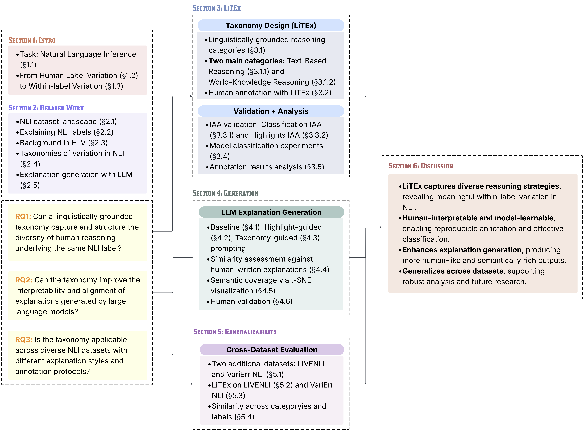

# Within-Label Variation in Natural Language Inference: A Linguistic Taxonomy for Explanations and Its Impact on Model Interpretation of Label Decisions

Repository for the materials associated with the Master Thesis **Within-Label Variation in Natural Language Inference: A Linguistic Taxonomy for Explanations and Its Impact on Model Interpretation of Label Decisions** at LMU Munich, June 2025.

## Thesis Goals and Contributions
This thesis aims to investigate the linguistic characteristics of explanations in Natural Language Inference (NLI) and their impact on model interpretation of label decisions. 

The key RQs are:
- **RQ1:** Can a linguistically grounded taxonomy capture and structure the diversity of human reasoning underlying the same NLI label?
- **RQ2:** Can the taxonomy improve the interpretability and alignment of explanations generated by large language models?
- **RQ3:** Is the taxonomy applicable across diverse NLI datasets with different explanation styles and annotation protocols?

Thesis Structure:
<p align="center">
  
</p>

## Getting Started
### Setting up the code environment
```
pip install -r requirements.txt
```

### Download spaCy language models
The code requires English and German spaCy models for tokenization and linguistic analysis. Run the following commands:
```
python -m spacy download en_core_web_sm
python -m spacy download de_core_news_md
```

## Content
### data
```
├── annotation_esnli.jsonl (annotation results for e-SNLI)
├── annotation_livenli.jsonl (annotation results for LiveNLI)
├── annotation_varierr.jsonl (annotation results for VariErr)
```

### annotation_interface
```
├── explanation_annotation.py
├── explanation_annotation_highlight.py
├── human_validation_annotation.py
```

The annotation interfaces are designed using Streamlit (https://github.com/streamlit/streamlit)

To run the interactive web app, please follow the Quickstart instruction provided on Streamlit Guide (https://github.com/streamlit/streamlit).

Then, open a terminal and run:

```
$ streamlit run explanation_annotation.py
$ streamlit run explanation_annotation_highlight.py
$ streamlit run human_validation_annotation.py
```

### iaa
```
├── classification_iaa
│   ├── annotator0_iaa.jsonl # classification annotation of annotator 0        
│   ├── annotator1_iaa.jsonl # classification annotation of annotator 1        
├── highlight_iaa
│   ├── annotator0_iaa_highlight.jsonl # highlight annotation of annotator 0
│   ├── annotator1_iaa_highlight.jsonl #highlight annotation of annotator 1
├── iaa.ipynb # notebook for iaa analysis 
```

### classification
```
├── bert.ipynb # notebook for fine-tuning BERT
├── roberta.ipynb # notebook for fine-tuning RoBERTa
├── llm_explanation_classifier.py # script for LLM-based explanation classification
├── classification_results
│   ├── deepseek
│   │   ├── predictions_deepseek-v3_baseline.jsonl 
│   │   ├── predictions_deepseek-v3_instruction.jsonl
│   │   ├── predictions_deepseek-v3_one_example.jsonl
│   │   ├── predictions_deepseek-v3_one_example_instruction.jsonl
│   │   ├── predictions_deepseek-v3_two_example.jsonl
│   │   ├── predictions_deepseek-v3_two_example_instruction.jsonl
│   ├── gpt3.5
│   │   ├── predictions_gpt3.5_baseline.jsonl 
│   │   ├── predictions_gpt3.5_instruction.jsonl
│   │   ├── predictions_gpt3.5_one_example.jsonl
│   │   ├── predictions_gpt3.5_one_example_instruction.jsonl
│   │   ├── predictions_gpt3.5_two_example.jsonl
│   │   ├── predictions_gpt3.5_two_example_instruction.jsonl
│   ├── gpt4o
│   │   ├── predictions_gpt4o_baseline.jsonl 
│   │   ├── predictions_gpt4o_instruction.jsonl
│   │   ├── predictions_gpt4o_one_example.jsonl
│   │   ├── predictions_gpt4o_one_example_instruction.jsonl
│   │   ├── predictions_gpt4o_two_example.jsonl
│   │   ├── predictions_gpt4o_two_example_instruction.jsonl
│   ├── llama
│   │   ├── predictions_llama_baseline.jsonl 
│   │   ├── predictions_llama_instruction.jsonl
│   │   ├── predictions_llama_one_example.jsonl
│   │   ├── predictions_llama_one_example_instruction.jsonl
│   │   ├── predictions_llama_two_example.jsonl
│   │   ├── predictions_llama_two_example_instruction.jsonl
├── README.md # instructions for running llm_explanation_classifier.py
```

### generation
```
├── llm_explanation
│   ├── Deepseek # generated explanations using ``deepseek-chat``
│   │   ├── deepseek_classify_and_generate.zip
│   │   ├── deepseek_highlight_index.zip
│   │   ├── deepseek_highlight_marked.zip
│   │   ├── deepseek_label.zip
│   │   ├── deepseek_taxonomy_filtered.zip
│   ├── GPT4o # generated explanations using ``gpt4o``
│   │   ├── gpt4o_classify_and_generate.zip
│   │   ├── gpt4o_highlight_index.zip
│   │   ├── gpt4o_highlight_marked.zip
│   │   ├── gpt4o_label.zip
│   │   ├── gpt4o_taxonomy_filtered.zip
│   ├── Llama # generated explanations using ``Llama-3.2-3B-Instruct``
│   │   ├── llama_classify_and_generate.zip
│   │   ├── llama_highlight_index.zip
│   │   ├── llama_highlight_marked.zip
│   │   ├── llama_label.zip
│   │   ├── llama_taxonomy_filtered.zip 
├── model_generator.py
├── README.md # instructions for running model_generator.py
```

### human_validation
```
├── annotated_validation.jsonl # results of human validation of model-generated explanations
```

### similarity_analysis
```
├── similarity_analysis.py
├── similarity_score
│   ├── livenli_similarity_per_instance_results.jsonl
│   ├── varierr_similarity_per_instance_results.jsonl
```